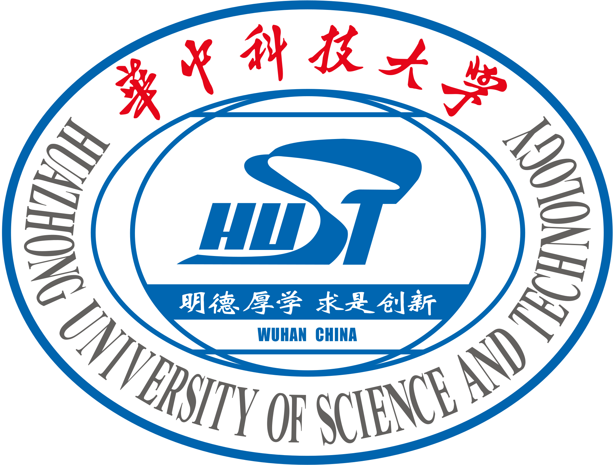
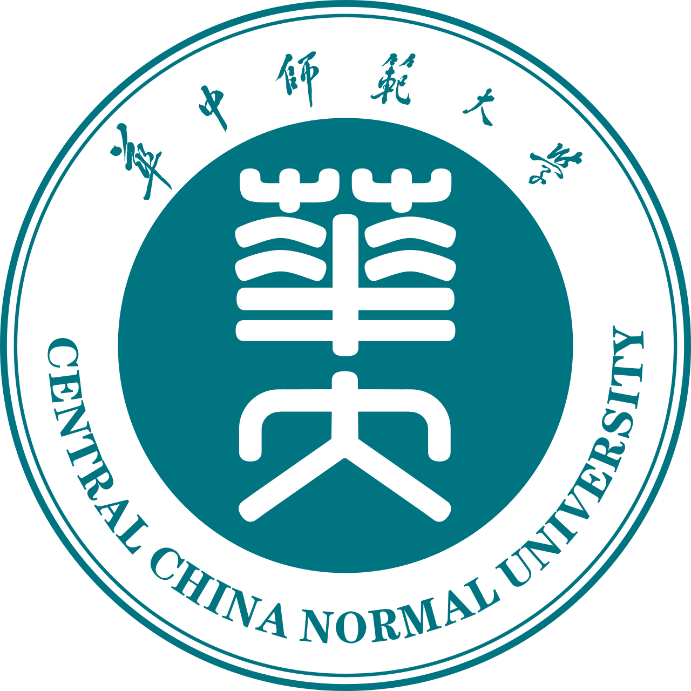

```{=html}
<div class="page-shell">
  <header class="page-hero">
    <p class="section-kicker"><span data-i18n="about_kicker">01 / Profile</span></p>
    <h1 data-i18n="about_title">About</h1>
    <p data-i18n="about_lead">Data scientist with dual master’s degrees. I cut through complexity and turn messy pain points into structured solutions that help decisions land fast.</p>
    <div class="hero-actions">
      <a class="btn btn-primary" href="resume.pdf" data-i18n="about_resume">Download resume</a>
      <a class="btn btn-ghost" href="mailto:iris0614ubc@gmail.com" data-i18n="contact_email">Email me</a>
    </div>
  </header>

  <p class="section-kicker"><span data-i18n="about_do_kicker">02 / Focus</span></p>
  <h2 class="section-heading" data-i18n="about_do_title">What I do</h2>
  <div class="card-grid">
    <article class="info-card">
      <h3 data-i18n="about_do_clean_title">Data cleaning &amp; transformation</h3>
      <p data-i18n="about_do_clean">I protect data integrity and get datasets analysis-ready through careful wrangling and QA.</p>
    </article>
    <article class="info-card">
      <h3 data-i18n="about_do_viz_title">Analysis &amp; visualization</h3>
      <p data-i18n="about_do_viz">I turn dense tables into clear stories with Power BI, Tableau, and Python, so teams can actually decide.</p>
    </article>
    <article class="info-card">
      <h3 data-i18n="about_do_ai_title">ML, AI &amp; generative AI</h3>
      <p data-i18n="about_do_ai">I apply models and language systems to real problems: NLP, SQL automation, computer vision, and forecasting.</p>
    </article>
  </div>

  <div class="block">
    <p class="section-kicker"><span data-i18n="about_edu_kicker">03 / Education</span></p>
    <h2 class="section-heading" data-i18n="about_edu_title">Education</h2>
    <div class="timeline">
      <article class="timeline-card">
        
        <div>
          <h3 data-i18n="about_edu_mds">Master of Data Science (GPA: 4.23/4.33)</h3>
          <p class="meta" data-i18n="about_edu_mds_school">University of British Columbia · Vancouver, BC</p>
          <p class="meta" data-i18n="about_edu_mds_time">Sep 2023 – Nov 2024</p>
          <p data-i18n="about_edu_mds_courses">Relevant coursework: Statistical Inference and Computation, Spatial and Temporal Models, Supervised Learning, Unsupervised Learning, Data Visualization, Algorithms and Data Structures, Collaborative Software Development, Databases and Data Retrieval, Web and Cloud Computing.</p>
          <p class="project-links"><a href="https://ubc-mds.github.io/descriptions/" target="_blank" rel="noopener noreferrer" data-i18n="about_edu_mds_link">Course descriptions</a></p>
        </div>
      </article>
      <article class="timeline-card">
        
        <div>
          <h3 data-i18n="about_edu_berk">Public Economics (Exchange)</h3>
          <p class="meta" data-i18n="about_edu_berk_gpa">GPA: 3.7/4.0</p>
          <p class="meta" data-i18n="about_edu_berk_school">University of California, Berkeley · California, United States</p>
          <p class="meta" data-i18n="about_edu_berk_time">Jul 2021 – Aug 2021</p>
        </div>
      </article>
      <article class="timeline-card">
        
        <div>
          <h3 data-i18n="about_edu_hust">Master of Science in Economics (GPA: 86.7/100)</h3>
          <p class="meta" data-i18n="about_edu_hust_school">Huazhong University of Science and Technology · Wuhan, China</p>
          <p class="meta" data-i18n="about_edu_hust_time">Sep 2020 – Jun 2023</p>
        </div>
      </article>
      <article class="timeline-card">
        
        <div>
          <h3 data-i18n="about_edu_ccnu">Bachelor of Science in Economics (GPA: 88.63/100)</h3>
          <p class="meta" data-i18n="about_edu_ccnu_school">Central China Normal University · Wuhan, China</p>
          <p class="meta" data-i18n="about_edu_ccnu_time">Sep 2016 – Jun 2020</p>
        </div>
      </article>
    </div>
  </div>

  <div class="block">
    <p class="section-kicker"><span data-i18n="about_cap_kicker">04 / Capstone</span></p>
    <h2 class="section-heading" data-i18n="about_cap_title">Capstone project</h2>
    <article class="detail-card">
      <p class="job-role" data-i18n="about_cap_role">Illuminex AI · Data Scientist</p>
      <p class="meta" data-i18n="about_cap_time">Apr 2024 – Jun 2024</p>
      <ul>
        <li data-i18n="about_cap_1">Built an object detection pipeline with Faster R-CNN, YOLOv8, and RetinaNet, reaching 60% mAP for bird-strike mitigation at Chengdu Shuangliu Airport — above the previous 49.5% best.</li>
        <li data-i18n="about_cap_2">Pioneered synthetic data augmentation with airplane imagery, improving realism and accuracy in complex airfield scenes.</li>
        <li data-i18n="about_cap_3">Managed large-scale datasets on AWS and optimized models for real-time inference. Awarded Best Talk in the UBC MDS program.</li>
      </ul>
    </article>
  </div>

  <div class="block">
    <p class="section-kicker"><span data-i18n="about_work_kicker">05 / Experience</span></p>
    <h2 class="section-heading" data-i18n="about_work_title">Work experience</h2>
    <div class="timeline">
      <article class="detail-card">
        <h3 data-i18n="about_job1_org">Beijing Academy of Social Sciences</h3>
        <p class="job-role" data-i18n="about_job1_role">Data Analyst Intern</p>
        <p class="meta" data-i18n="about_job1_time">Sep 2019 – Feb 2020</p>
        <ul>
          <li data-i18n="about_job1_1">Optimized MySQL queries, cutting page load time by 15% and speeding retrieval by 20%.</li>
          <li data-i18n="about_job1_2">Analyzed 20,000+ records, uncovering insights that improved student engagement metrics by 12%.</li>
          <li data-i18n="about_job1_3">Built reports and dashboards for senior leadership, supporting a 10% gain in operational efficiency.</li>
        </ul>
      </article>
      <article class="detail-card">
        <h3 data-i18n="about_job2_org">Deloitte</h3>
        <p class="job-role" data-i18n="about_job2_role">Audit and Assurance Intern</p>
        <p class="meta" data-i18n="about_job2_time">Jul 2019 – Aug 2019</p>
        <ul>
          <li data-i18n="about_job2_1">Ran financial analysis on major corporates, including Guangshen Railway, lifting assessment accuracy by 20% across 5,000+ data points in Python.</li>
          <li data-i18n="about_job2_2">Completed data audits and 15+ Power BI reports that reduced senior review time by 30%.</li>
        </ul>
      </article>
      <article class="detail-card">
        <h3 data-i18n="about_job3_org">Zhongshan Securities</h3>
        <p class="job-role" data-i18n="about_job3_role">Investment Banking Intern</p>
        <p class="meta" data-i18n="about_job3_time">Apr 2019 – Jun 2019</p>
        <ul>
          <li data-i18n="about_job3_1">Built valuation and financial models with 90% accuracy on valuation premiums, using growth, profitability, and competitive analysis.</li>
          <li data-i18n="about_job3_2">Streamlined due diligence by 20% through deeper financial and capital-structure review.</li>
        </ul>
      </article>
      <article class="detail-card">
        <h3 data-i18n="about_job4_org">Agricultural Bank of China</h3>
        <p class="job-role" data-i18n="about_job4_role">Risk Management Intern</p>
        <p class="meta" data-i18n="about_job4_time">Jul 2018 – Aug 2018</p>
        <ul>
          <li data-i18n="about_job4_1">Applied machine learning to 4,000+ loans, improving customer rating and risk-assessment accuracy by 10%.</li>
          <li data-i18n="about_job4_2">Worked with the risk team to fold model insights into production financial models.</li>
        </ul>
      </article>
    </div>
  </div>

  <div class="block">
    <p class="section-kicker"><span data-i18n="about_vol_kicker">06 / Community</span></p>
    <h2 class="section-heading" data-i18n="about_vol_title">Volunteer</h2>
    <article class="detail-card">
      <h3 data-i18n="about_vol_org">Rural Education Empowerment Plan</h3>
      <p class="meta" data-i18n="about_vol_time">Jan 2017 – Dec 2018</p>
      <ul>
        <li data-i18n="about_vol_1">Helped design a 1+1+1 model pairing 502 rural teachers with university students for mutual learning, spanning research and practice.</li>
        <li data-i18n="about_vol_2">Supported a 1+X volunteer management model that grew to 600+ volunteers and 20 primary schools.</li>
        <li data-i18n="about_vol_3">Helped negotiate partnerships that secured $29,000 in funding from nonprofits and tech companies.</li>
        <li data-i18n="about_vol_4">Contributed to teacher training with ICT, mixed-mode teaching, and flipped-classroom resources for rural schools.</li>
      </ul>
      <ul class="award-list">
        <li data-i18n="about_vol_a1">Gold Award · Fourth ‘Internet+’ University Students Innovation and Entrepreneurship Competition, Hubei.</li>
        <li data-i18n="about_vol_a2">Gold (Hubei) and Silver (national) · 2018 China University Students’ Entrepreneurship Competition.</li>
        <li data-i18n="about_vol_a3">Gold (Hubei) and Silver (national) · 2018 China Youth Volunteer Service Project Competition.</li>
      </ul>
    </article>
  </div>

  <div class="block">
    <p class="section-kicker"><span data-i18n="about_ach_kicker">07 / Strengths</span></p>
    <h2 class="section-heading" data-i18n="about_ach_title">Achievements &amp; skills</h2>
    <div class="card-grid two">
      <article class="info-card">
        <h3 data-i18n="about_ach_1_title">Data visualization</h3>
        <p data-i18n="about_ach_1">Visual systems that cut report review time by 30%, using Tableau, Power BI, and Python.</p>
      </article>
      <article class="info-card">
        <h3 data-i18n="about_ach_2_title">Generative AI</h3>
        <p data-i18n="about_ach_2">Shipped NL-to-SQL and other generative workflows that compress the path from question to decision.</p>
      </article>
      <article class="info-card">
        <h3 data-i18n="about_ach_3_title">Operating leverage</h3>
        <p data-i18n="about_ach_3">Automated analysis prep and reduced turnaround by 25% through cleaner pipelines.</p>
      </article>
      <article class="info-card">
        <h3 data-i18n="about_ach_4_title">Insight generation</h3>
        <p data-i18n="about_ach_4">Translate dense datasets into business intelligence that leadership can act on.</p>
      </article>
    </div>
  </div>

  <footer class="site-footer">
    <span data-i18n="footer_left">© 2026 Iris Luo</span>
    <span data-i18n="footer_copy">Designed as a bilingual portfolio.</span>
  </footer>
</div>
```
