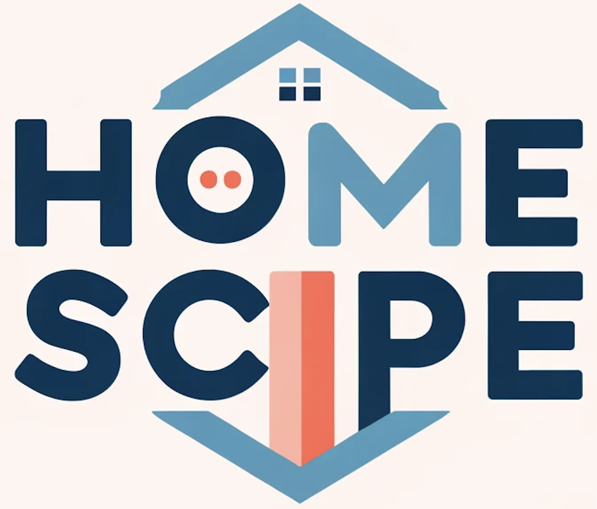
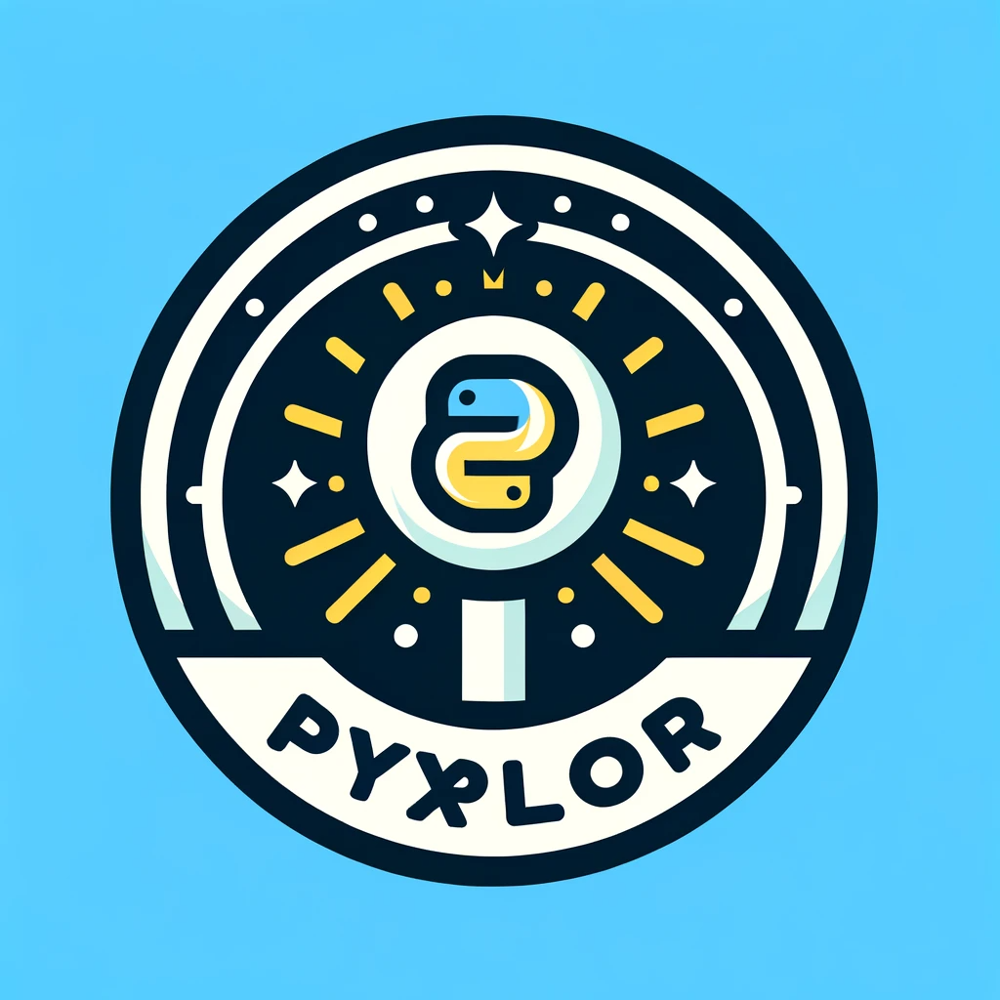

```{=html}
<div class="page-shell">
  <section class="bento" aria-label="Introduction">
    <article class="tile tile-hero">
      <div>
        <span class="eyebrow"><span class="dot"></span><span data-i18n="hero_kicker">Open to opportunities</span></span>
        <h1 class="hero-name" data-i18n="hero_name">Iris Luo</h1>
        <p class="hero-role" data-i18n="hero_role">Data Scientist · Generative AI</p>
        <p class="hero-bio" data-i18n="hero_bio">I build reliable data products across cleaning, visualization, modeling, and generative AI — with dual master’s degrees in Data Science and Economics.</p>
        <div class="hero-actions">
          <a class="btn btn-primary" href="projects.html" data-i18n="cta_projects">View projects</a>
          <a class="btn btn-ghost" href="resume.pdf" data-i18n="cta_resume">Resume</a>
        </div>
      </div>
      <div class="stat-row">
        <div class="stat"><b>2+</b><span data-i18n="stat_years">Years in data</span></div>
        <div class="stat"><b>2</b><span data-i18n="stat_degrees">Master’s degrees</span></div>
        <div class="stat"><b>6</b><span data-i18n="stat_projects">Selected projects</span></div>
      </div>
    </article>

    <article class="tile tile-photo">
      
      <div class="photo-caption" data-i18n="photo_caption">UBC MDS · Vancouver</div>
    </article>

    <article class="tile tile-skills">
      <p class="tile-label" data-i18n="skills_label">Skills</p>
      <div class="skill-groups">
        <div class="skill-group">
          <h3 data-i18n="skills_ml">Machine learning &amp; AI</h3>
          <div class="pills">
            <span class="pill">PyTorch</span>
            <span class="pill">YOLOv8</span>
            <span class="pill">Generative AI</span>
            <span class="pill">NLP</span>
            <span class="pill">scikit-learn</span>
          </div>
        </div>
        <div class="skill-group">
          <h3 data-i18n="skills_data">Data &amp; visualization</h3>
          <div class="pills">
            <span class="pill">Python</span>
            <span class="pill">SQL</span>
            <span class="pill">R</span>
            <span class="pill">Tableau</span>
            <span class="pill">Power BI</span>
            <span class="pill">Plotly</span>
            <span class="pill">Altair</span>
          </div>
        </div>
        <div class="skill-group">
          <h3 data-i18n="skills_eng">Engineering</h3>
          <div class="pills">
            <span class="pill">AWS</span>
            <span class="pill">PostgreSQL</span>
            <span class="pill">Streamlit</span>
            <span class="pill">Dash</span>
            <span class="pill">Git</span>
            <span class="pill">Pandas</span>
          </div>
        </div>
      </div>
    </article>

    <article class="tile tile-social">
      <p class="tile-label" data-i18n="social_label">Connect</p>
      <p class="social-copy" data-i18n="social_copy">The fastest way to reach me is email. LinkedIn and GitHub are always open too.</p>
      <div class="social-list">
        <a class="social-btn" href="mailto:iris0614ubc@gmail.com" data-i18n-aria="aria_email" aria-label="Email Iris Luo">
          <span class="social-icon" data-icon="mail"></span>
          <span><span data-i18n="social_email">Email</span><small data-i18n="social_email_hint">iris0614ubc@gmail.com</small></span>
        </a>
        <a class="social-btn" href="https://www.linkedin.com/in/iris-luo/" target="_blank" rel="noopener noreferrer" data-i18n-aria="aria_linkedin" aria-label="Iris Luo on LinkedIn">
          <span class="social-icon" data-icon="linkedin"></span>
          <span><span data-i18n="social_linkedin">LinkedIn</span><small data-i18n="social_linkedin_hint">iris-luo</small></span>
        </a>
        <a class="social-btn" href="https://github.com/iris0614" target="_blank" rel="noopener noreferrer" data-i18n-aria="aria_github" aria-label="Iris Luo on GitHub">
          <span class="social-icon" data-icon="github"></span>
          <span><span data-i18n="social_github">GitHub</span><small data-i18n="social_github_hint">iris0614</small></span>
        </a>
      </div>
    </article>
  </section>

  <section class="block" id="projects">
    <p class="section-kicker"><span data-i18n="featured_kicker">02 / Work</span></p>
    <div style="display:flex;justify-content:space-between;align-items:end;gap:1rem;flex-wrap:wrap;">
      <h2 class="section-heading" data-i18n="featured_title">Selected projects</h2>
      <a class="btn btn-ghost" href="projects.html" data-i18n="view_all">All projects</a>
    </div>
    <div class="project-grid">
      <article class="project-card">
        <div class="project-media"></div>
        <div class="project-body">
          <h3 data-i18n="p_sql_title">SQL Genius</h3>
          <p data-i18n="p_sql_desc">Natural-language SQL agent for SQLite and PostgreSQL — ask a question, get the query and the result.</p>
          <div class="pills"><span class="pill">Streamlit</span><span class="pill">OpenAI</span><span class="pill">SQL</span></div>
          <div class="project-links">
            <a href="https://sqlgenius20250212.streamlit.app/" target="_blank" rel="noopener noreferrer" data-i18n="live">Live</a>
            <a href="https://github.com/iris0614/SQLGenius" target="_blank" rel="noopener noreferrer" data-i18n="github">GitHub</a>
          </div>
        </div>
      </article>
      <article class="project-card">
        <div class="project-media is-cover"></div>
        <div class="project-body">
          <h3 data-i18n="p_air_title">Airfield Hazards</h3>
          <p data-i18n="p_air_desc">Object detection pipeline for real-time bird tracking at airports, awarded Best Talk in UBC MDS.</p>
          <div class="pills"><span class="pill">YOLOv8</span><span class="pill">PyTorch</span><span class="pill">AWS</span></div>
          <div class="project-links">
            <a href="https://masterdatascience.ubc.ca/why-data-science/data-stories/airfield-hazards-bird-tracking-airports" target="_blank" rel="noopener noreferrer" data-i18n="report">Report</a>
            <a href="airbird.pdf" data-i18n="paper">Paper</a>
          </div>
        </div>
      </article>
      <article class="project-card">
        <div class="project-media"></div>
        <div class="project-body">
          <h3 data-i18n="p_churn_title">Churn Insights</h3>
          <p data-i18n="p_churn_desc">End-to-end churn analysis: PostgreSQL ETL, Tableau, and a model bake-off across classic ML algorithms.</p>
          <div class="pills"><span class="pill">Tableau</span><span class="pill">PostgreSQL</span><span class="pill">Python</span></div>
          <div class="project-links">
            <a href="https://github.com/iris0614/Churn-Insights-Project" target="_blank" rel="noopener noreferrer" data-i18n="github">GitHub</a>
          </div>
        </div>
      </article>
      <article class="project-card">
        <div class="project-media"></div>
        <div class="project-body">
          <h3 data-i18n="p_home_title">HomeScope</h3>
          <p data-i18n="p_home_desc">Interactive real-estate analytics for investors, planners, and market analysts.</p>
          <div class="pills"><span class="pill">Dash</span><span class="pill">Plotly</span><span class="pill">PyArrow</span></div>
          <div class="project-links">
            <a href="https://dsci-532-2024-5-homescope.onrender.com/" target="_blank" rel="noopener noreferrer" data-i18n="live">Live</a>
            <a href="https://github.com/UBC-MDS/DSCI-532_2024_5_HomeScope" target="_blank" rel="noopener noreferrer" data-i18n="github">GitHub</a>
          </div>
        </div>
      </article>
      <article class="project-card">
        <div class="project-media"></div>
        <div class="project-body">
          <h3 data-i18n="p_crypto_title">CryptoPulse</h3>
          <p data-i18n="p_crypto_desc">Shiny dashboard for exploring cryptocurrency markets, with a focus on Bitcoin and Ethereum.</p>
          <div class="pills"><span class="pill">Shiny</span><span class="pill">Plotly</span><span class="pill">R</span></div>
          <div class="project-links">
            <a href="https://github.com/iris0614/CryptoPulse" target="_blank" rel="noopener noreferrer" data-i18n="github">GitHub</a>
          </div>
        </div>
      </article>
      <article class="project-card">
        <div class="project-media"></div>
        <div class="project-body">
          <h3 data-i18n="p_pyx_title">Pyxplor</h3>
          <p data-i18n="p_pyx_desc">Python package that automates EDA across numeric, categorical, binary, and time-series data.</p>
          <div class="pills"><span class="pill">PyPI</span><span class="pill">Pytest</span><span class="pill">Poetry</span></div>
          <div class="project-links">
            <a href="https://pyxplor.readthedocs.io/en/latest/" target="_blank" rel="noopener noreferrer" data-i18n="docs">Docs</a>
            <a href="https://github.com/UBC-MDS/PyXplor" target="_blank" rel="noopener noreferrer" data-i18n="github">GitHub</a>
          </div>
        </div>
      </article>
    </div>
  </section>

  <section class="contact-band" id="contact">
    <div>
      <h2 data-i18n="contact_title">Let’s work together</h2>
      <p data-i18n="contact_copy">Available for data science, generative AI, and analytics roles.</p>
    </div>
    <div class="hero-actions" style="margin:0;">
      <a class="btn btn-primary" href="mailto:iris0614ubc@gmail.com" data-i18n="contact_email">Email me</a>
      <a class="btn btn-ghost" href="about.html" data-i18n="cta_about">About me</a>
    </div>
  </section>

  <footer class="site-footer">
    <span>© 2026 Iris Luo</span>
    <span data-i18n="footer_copy">Designed as a bilingual portfolio.</span>
  </footer>
</div>
```
