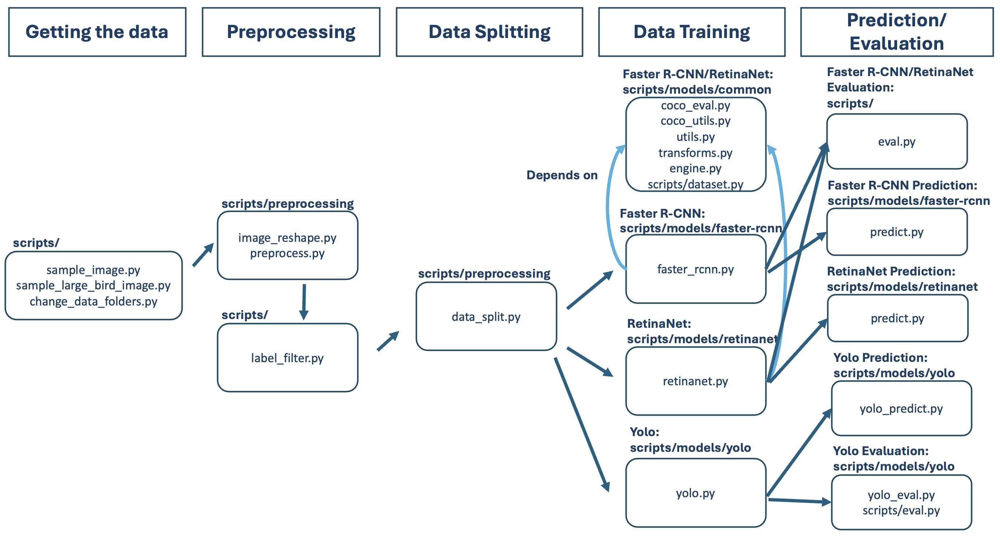
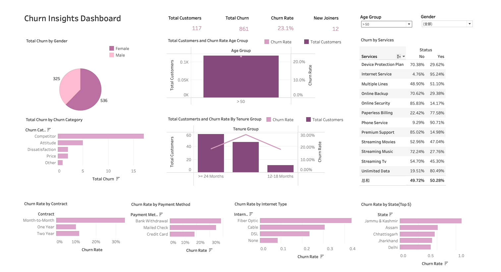
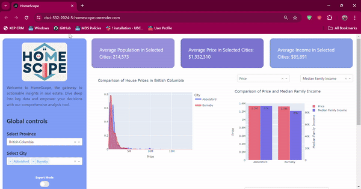
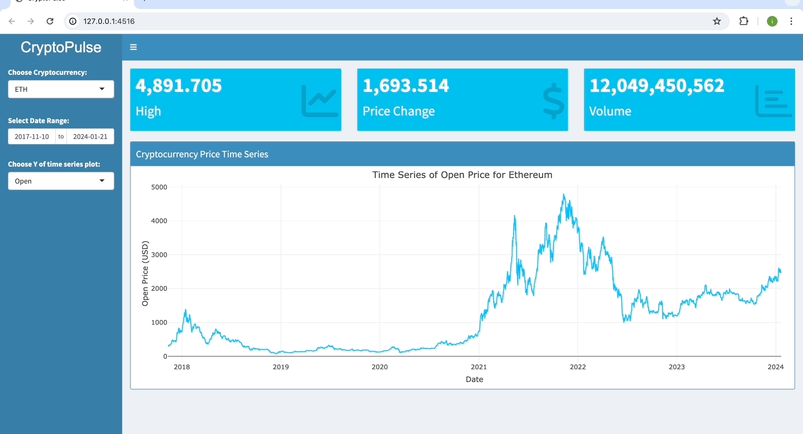

```{=html}
<div class="page-shell">
  <header class="page-hero">
    <p class="section-kicker"><span data-i18n="proj_kicker">Selected work</span></p>
    <h1 data-i18n="proj_title">Projects</h1>
    <p data-i18n="proj_lead">A few systems I have designed, built, and shipped — from generative SQL to computer vision on the airfield.</p>
  </header>

  <article class="detail-card block" style="margin-top:0;">
    <div style="display:flex;align-items:center;gap:.7rem;margin-bottom:.4rem;">
      
      <h3 data-i18n="p_sql_title" style="margin:0;">SQL Genius</h3>
    </div>
    <p data-i18n="proj_sql_desc">An AI SQL agent that turns plain language into queries. Users upload a SQLite database, ask a question, and receive both the SQL and the result — so non-technical teammates can still interrogate data.</p>
    <p class="meta"><span data-i18n="tech">Tech</span>: <span data-i18n="proj_sql_tech">Python (Streamlit, Pandas), OpenAI API, SQL (PostgreSQL, SQLite)</span></p>
    <p class="meta" data-i18n="proj_sql_ai">OpenAI models interpret the question and generate SQL dynamically.</p>
    <div class="project-links">
      <a href="https://sqlgenius20250212.streamlit.app/" target="_blank" rel="noopener noreferrer" data-i18n="live">Live</a>
      <a href="https://github.com/iris0614/SQLGenius" target="_blank" rel="noopener noreferrer" data-i18n="github">GitHub</a>
    </div>
  </article>

  <article class="detail-card block">
    <h3 data-i18n="p_air_title">Airfield Hazards</h3>
    <p data-i18n="proj_air_desc">A cost-effective object detection pipeline for real-time bird identification at airports, using RetinaNet, YOLOv8, and careful preprocessing to raise both performance and safety.</p>
    <p class="meta"><span data-i18n="tech">Tech</span>: <span data-i18n="proj_air_tech">Python (Altair, Matplotlib, PyTorch, Pandas, NumPy, Pytest), Makefile, AWS</span></p>
    <p class="meta" data-i18n="proj_air_models">Models: RetinaNet, YOLOv8, Faster R-CNN</p>
    <div class="project-links">
      <a href="airbird.pdf" data-i18n="paper">Paper</a>
      <a href="https://masterdatascience.ubc.ca/why-data-science/data-stories/airfield-hazards-bird-tracking-airports" target="_blank" rel="noopener noreferrer" data-i18n="report">Report</a>
    </div>
    <p class="job-role" style="margin-top:1rem;" data-i18n="proj_air_pipe">Project pipeline</p>
    <div class="media-frame"></div>
    <p class="job-role" style="margin-top:1rem;" data-i18n="proj_air_scripts">How the scripts interact</p>
    <div class="media-frame"></div>
  </article>

  <article class="detail-card block">
    <div style="display:flex;align-items:center;gap:.7rem;margin-bottom:.4rem;">
      
      <h3 data-i18n="p_churn_title" style="margin:0;">Churn Insights</h3>
    </div>
    <p data-i18n="proj_churn_desc">ETL and cleaning in PostgreSQL, richer visuals in Tableau, then a model comparison in Jupyter — KNN, Decision Tree, Random Forest, RBF SVM, and Logistic Regression — after thorough EDA.</p>
    <p class="meta"><span data-i18n="tech">Tech</span>: <span data-i18n="proj_churn_tech">Python (Altair, Matplotlib, Plotly, PyTorch, Seaborn, Pandas, NumPy), Tableau, PostgreSQL</span></p>
    <div class="project-links">
      <a href="https://github.com/iris0614/Churn-Insights-Project" target="_blank" rel="noopener noreferrer" data-i18n="github">GitHub</a>
    </div>
    <div class="media-frame"></div>
  </article>

  <article class="detail-card block">
    <div style="display:flex;align-items:center;gap:.7rem;margin-bottom:.4rem;">
      
      <h3 data-i18n="p_home_title" style="margin:0;">HomeScope</h3>
    </div>
    <p data-i18n="proj_home_desc">An analytics platform for the real-estate market. Built for investors, developers, analysts, and urban planners who need a clear read on what actually moves property value.</p>
    <p class="meta"><span data-i18n="tech">Tech</span>: <span data-i18n="proj_home_tech">Python (Altair, Plotly, Pandas, PyArrow), Dash</span></p>
    <div class="project-links">
      <a href="https://dsci-532-2024-5-homescope.onrender.com/" target="_blank" rel="noopener noreferrer" data-i18n="proj_home_dash">Dashboard</a>
      <a href="https://github.com/UBC-MDS/DSCI-532_2024_5_HomeScope" target="_blank" rel="noopener noreferrer" data-i18n="github">GitHub</a>
    </div>
    <div class="media-frame"></div>
  </article>

  <article class="detail-card block">
    <div style="display:flex;align-items:center;gap:.7rem;margin-bottom:.4rem;">
      
      <h3 data-i18n="p_crypto_title" style="margin:0;">CryptoPulse</h3>
    </div>
    <p data-i18n="proj_crypto_desc">A Shiny dashboard for exploring cryptocurrency data, with a focus on Bitcoin and Ethereum.</p>
    <p class="meta"><span data-i18n="tech">Tech</span>: <span data-i18n="proj_crypto_tech">Python (Plotly), R (dplyr), Shiny</span></p>
    <div class="project-links">
      <a href="https://github.com/iris0614/CryptoPulse" target="_blank" rel="noopener noreferrer" data-i18n="github">GitHub</a>
    </div>
    <div class="media-frame"></div>
  </article>

  <article class="detail-card block">
    <div style="display:flex;align-items:center;gap:.7rem;margin-bottom:.4rem;">
      
      <h3 data-i18n="p_pyx_title" style="margin:0;">Pyxplor</h3>
    </div>
    <p data-i18n="proj_pyx_desc">A Python package that automates exploratory data analysis for numeric, categorical, binary, and time-series data — less boilerplate, faster first look.</p>
    <p class="meta"><span data-i18n="tech">Tech</span>: <span data-i18n="proj_pyx_tech">Python (PyPI, Pytest, Seaborn, Pandas), Poetry, Cookiecutter</span></p>
    <div class="project-links">
      <a href="https://pyxplor.readthedocs.io/en/latest/" target="_blank" rel="noopener noreferrer" data-i18n="docs">Docs</a>
      <a href="https://github.com/UBC-MDS/PyXplor" target="_blank" rel="noopener noreferrer" data-i18n="github">GitHub</a>
    </div>
  </article>

  <section class="contact-band">
    <div>
      <h2 data-i18n="contact_title">Let’s work together</h2>
      <p data-i18n="contact_copy">Available for data science, generative AI, and analytics roles.</p>
    </div>
    <a class="btn btn-primary" href="mailto:iris0614ubc@gmail.com" data-i18n="contact_email">Email me</a>
  </section>

  <footer class="site-footer">
    <span>© 2026 Iris Luo</span>
    <span data-i18n="footer_copy">Designed as a bilingual portfolio.</span>
  </footer>
</div>
```
