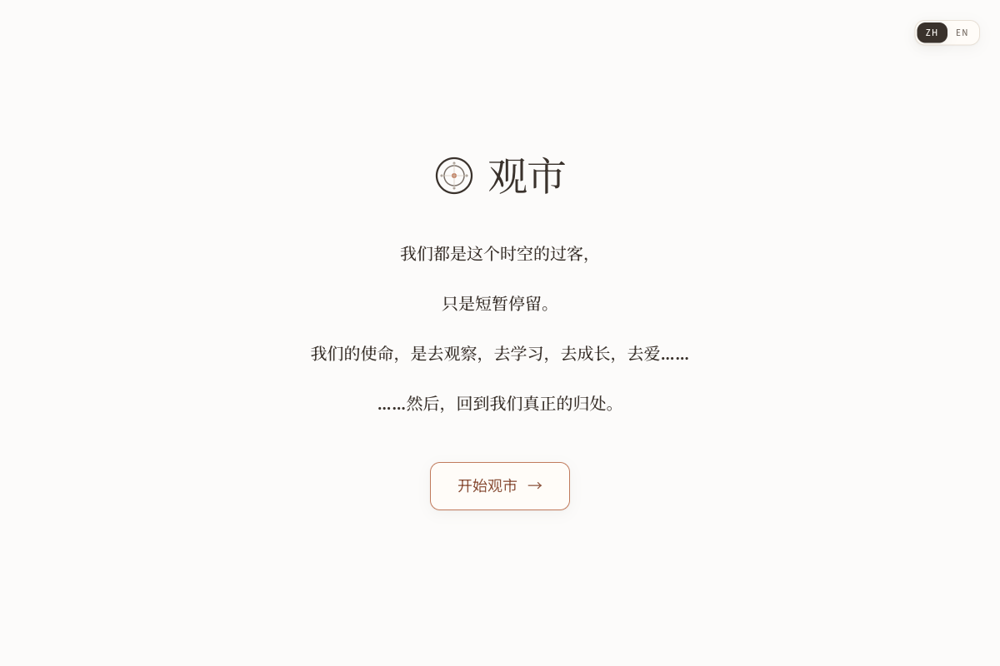

```{=html}
<div class="page-shell">
  <header class="page-hero">
    <p class="section-kicker"><span data-i18n="proj_kicker">Selected work</span></p>
    <h1 data-i18n="proj_title">Projects</h1>
    <p data-i18n="proj_lead">Selected systems I’ve designed, built, and shipped — from a reading journal and investment notebook to generative SQL and computer vision.</p>
  </header>

  <div class="project-grid">
    <article class="project-card">
      <div class="project-media is-cover"></div>
      <div class="project-body">
        <h3 data-i18n="p_notes_title">Reading Notes</h3>
        <p data-i18n="proj_notes_desc">An editorial reading-notes site with a magazine layout: paper-colored pages, staggered cards, and long-form essays. Volume 01 currently holds seventeen pieces.</p>
        <p class="meta"><span data-i18n="tech">Tech</span>: <span data-i18n="proj_notes_tech">Next.js, TypeScript, Python</span></p>
        <div class="pills"><span class="pill">Next.js</span><span class="pill">TypeScript</span><span class="pill">Python</span></div>
        <div class="project-links">
          <a href="https://reading-notes-pearl.vercel.app" target="_blank" rel="noopener noreferrer" data-i18n="live">Live</a>
        </div>
      </div>
    </article>

    <article class="project-card">
      <div class="project-media is-cover"></div>
      <div class="project-body">
        <h3 data-i18n="p_zen_title">MarketZen</h3>
        <p data-i18n="proj_zen_desc">A minimal local investment journal for recording trades, distilling principles, and reviewing growth. Dashboard, trade log, diary, and review filters — all stored in the browser. No signup, no cloud.</p>
        <p class="meta"><span data-i18n="tech">Tech</span>: <span data-i18n="proj_zen_tech">React, TypeScript, Vite, Tailwind CSS, Recharts</span></p>
        <div class="pills"><span class="pill">React</span><span class="pill">TypeScript</span><span class="pill">Vite</span></div>
        <div class="project-links">
          <a href="https://marketzen-app.vercel.app/" target="_blank" rel="noopener noreferrer" data-i18n="live">Live</a>
          <a href="https://github.com/iris0614/marketzen" target="_blank" rel="noopener noreferrer" data-i18n="github">GitHub</a>
        </div>
      </div>
    </article>

    <article class="project-card">
      <div class="project-media"></div>
      <div class="project-body">
        <h3 data-i18n="p_sql_title">SQL Genius</h3>
        <p data-i18n="proj_sql_desc">An AI SQL agent that turns plain language into queries. Users upload a SQLite database, ask a question, and receive both the SQL and the result — so non-technical teammates can still interrogate data.</p>
        <p class="meta"><span data-i18n="tech">Tech</span>: <span data-i18n="proj_sql_tech">Python (Streamlit, Pandas), OpenAI API, SQL (PostgreSQL, SQLite)</span></p>
        <div class="pills"><span class="pill">Streamlit</span><span class="pill">OpenAI</span><span class="pill">SQL</span></div>
        <div class="project-links">
          <a href="https://sqlgenius20250212.streamlit.app/" target="_blank" rel="noopener noreferrer" data-i18n="live">Live</a>
          <a href="https://github.com/iris0614/SQLGenius" target="_blank" rel="noopener noreferrer" data-i18n="github">GitHub</a>
        </div>
      </div>
    </article>

    <article class="project-card">
      <div class="project-media is-cover"></div>
      <div class="project-body">
        <h3 data-i18n="p_air_title">Airfield Hazards</h3>
        <p data-i18n="proj_air_desc">A cost-effective object detection pipeline for real-time bird identification at airports, using RetinaNet, YOLOv8, and careful preprocessing to raise both performance and safety.</p>
        <p class="meta"><span data-i18n="tech">Tech</span>: <span data-i18n="proj_air_tech">Python (Altair, Matplotlib, PyTorch, Pandas, NumPy, Pytest), Makefile, AWS</span></p>
        <p class="meta" data-i18n="proj_air_models">Models: RetinaNet, YOLOv8, Faster R-CNN</p>
        <div class="pills"><span class="pill">YOLOv8</span><span class="pill">PyTorch</span><span class="pill">AWS</span></div>
        <div class="project-links">
          <a href="airbird.pdf" data-i18n="paper">Paper</a>
          <a href="https://masterdatascience.ubc.ca/why-data-science/data-stories/airfield-hazards-bird-tracking-airports" target="_blank" rel="noopener noreferrer" data-i18n="report">Report</a>
        </div>
      </div>
    </article>

    <article class="project-card">
      <div class="project-media"></div>
      <div class="project-body">
        <h3 data-i18n="p_churn_title">Churn Insights</h3>
        <p data-i18n="proj_churn_desc">ETL and cleaning in PostgreSQL, richer visuals in Tableau, then a model comparison in Jupyter — KNN, Decision Tree, Random Forest, RBF SVM, and Logistic Regression — after thorough EDA.</p>
        <p class="meta"><span data-i18n="tech">Tech</span>: <span data-i18n="proj_churn_tech">Python (Altair, Matplotlib, Plotly, PyTorch, Seaborn, Pandas, NumPy), Tableau, PostgreSQL</span></p>
        <div class="pills"><span class="pill">Tableau</span><span class="pill">PostgreSQL</span><span class="pill">Python</span></div>
        <div class="project-links">
          <a href="https://github.com/iris0614/Churn-Insights-Project" target="_blank" rel="noopener noreferrer" data-i18n="github">GitHub</a>
        </div>
      </div>
    </article>

    <article class="project-card">
      <div class="project-media"></div>
      <div class="project-body">
        <h3 data-i18n="p_home_title">HomeScope</h3>
        <p data-i18n="proj_home_desc">An analytics platform for the real-estate market. Built for investors, developers, analysts, and urban planners who need a clear read on what actually moves property value.</p>
        <p class="meta"><span data-i18n="tech">Tech</span>: <span data-i18n="proj_home_tech">Python (Altair, Plotly, Pandas, PyArrow), Dash</span></p>
        <div class="pills"><span class="pill">Dash</span><span class="pill">Plotly</span><span class="pill">PyArrow</span></div>
        <div class="project-links">
          <a href="https://dsci-532-2024-5-homescope.onrender.com/" target="_blank" rel="noopener noreferrer" data-i18n="proj_home_dash">Dashboard</a>
          <a href="https://github.com/UBC-MDS/DSCI-532_2024_5_HomeScope" target="_blank" rel="noopener noreferrer" data-i18n="github">GitHub</a>
        </div>
      </div>
    </article>

    <article class="project-card">
      <div class="project-media"></div>
      <div class="project-body">
        <h3 data-i18n="p_crypto_title">CryptoPulse</h3>
        <p data-i18n="proj_crypto_desc">A Shiny dashboard for exploring cryptocurrency data, with a focus on Bitcoin and Ethereum.</p>
        <p class="meta"><span data-i18n="tech">Tech</span>: <span data-i18n="proj_crypto_tech">Python (Plotly), R (dplyr), Shiny</span></p>
        <div class="pills"><span class="pill">Shiny</span><span class="pill">Plotly</span><span class="pill">R</span></div>
        <div class="project-links">
          <a href="https://github.com/iris0614/CryptoPulse" target="_blank" rel="noopener noreferrer" data-i18n="github">GitHub</a>
        </div>
      </div>
    </article>

    <article class="project-card">
      <div class="project-media"></div>
      <div class="project-body">
        <h3 data-i18n="p_pyx_title">Pyxplor</h3>
        <p data-i18n="proj_pyx_desc">A Python package that automates exploratory data analysis for numeric, categorical, binary, and time-series data — less boilerplate, faster first look.</p>
        <p class="meta"><span data-i18n="tech">Tech</span>: <span data-i18n="proj_pyx_tech">Python (PyPI, Pytest, Seaborn, Pandas), Poetry, Cookiecutter</span></p>
        <div class="pills"><span class="pill">PyPI</span><span class="pill">Pytest</span><span class="pill">Poetry</span></div>
        <div class="project-links">
          <a href="https://pyxplor.readthedocs.io/en/latest/" target="_blank" rel="noopener noreferrer" data-i18n="docs">Docs</a>
          <a href="https://github.com/UBC-MDS/PyXplor" target="_blank" rel="noopener noreferrer" data-i18n="github">GitHub</a>
        </div>
      </div>
    </article>
  </div>

  <article class="detail-card block">
    <h3 data-i18n="p_air_title">Airfield Hazards</h3>
    <p class="job-role" data-i18n="proj_air_pipe">Project pipeline</p>
    <div class="diagram-grid">
      <div class="media-frame"></div>
      <div>
        <p class="job-role" data-i18n="proj_air_scripts">How the scripts interact</p>
        <div class="media-frame"></div>
      </div>
    </div>
  </article>

  <section class="contact-band">
    <div>
      <h2 data-i18n="contact_title">Let’s work together</h2>
      <p data-i18n="contact_copy">Open to roles in data science, generative AI, and analytics.</p>
    </div>
    <a class="btn btn-primary" href="mailto:iris0614ubc@gmail.com" data-i18n="contact_email">Email me</a>
  </section>

  <footer class="site-footer">
    <span data-i18n="footer_left">© 2026 Iris Luo</span>
    <span data-i18n="footer_copy">Designed as a bilingual portfolio.</span>
  </footer>
</div>
```
